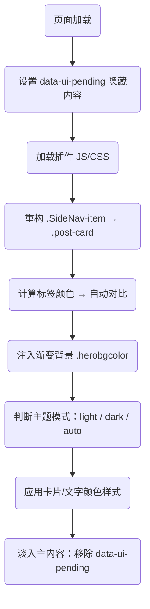

# 🍎 Gmeek UI 增强插件使用教程

## 📦 插件简介

Gmeek UI 插件通过纯前端增强的方式，为 Gmeek 框架博客带来 Apple 风格的焕然一新体验，包括：

| 文件名                   | 功能说明                                                                 |
|--------------------------|--------------------------------------------------------------------------|
| `GmeekBaseTheme.css`     | 基础布局样式：字体、圆角、卡片排版，兼容原始结构不污染构建样式                          |
| `GmeekCustomizeCss.js`   | UI 动态增强：卡片结构重构、玻璃拟态样式、深浅模式自适应、渐变背景、标签配色自动对比等功能       |

> 🧠 零依赖、构建无侵入、插拔可选、明暗自动识别、视觉沉浸体验，100% 兼容 Gmeek 原生内容结构。

---

## ✨ 功能亮点

| 模块                    | 功能描述                                                                 |
|-------------------------|--------------------------------------------------------------------------|
| 🍏 Apple 风格排版         | 使用 SF 字体栈 + 圆角 + 动效 + 阴影构建沉浸式阅读体验                                  |
| 🧱 卡片结构重构           | 将 `.SideNav-item` 动态转为 `.post-card`，支持标题/标签/摘要生成                    |
| 🧊 玻璃拟态样式           | 卡片使用半透明玻璃效果，搭配背景模糊、边框、阴影增强视觉层次                              |
| 🌗 主题适配支持           | 自动识别 `<html data-color-mode>` 中的 `light` / `dark` / `auto` 三种模式             |
| 🌈 动态渐变背景           | 渐变呼吸背景使用 `hue-rotate` 动效，明暗模式下自适配颜色主题                                  |
| 🏷️ 标签配色对比自动识别    | 标签从 `.Label` 提取背景色，并自动计算亮度决定字体使用白色或黑色，确保最佳可读性                    |
| 🧼 样式作用域隔离         | 插件仅影响 `.post-card` 区域，正文、评论、页眉页脚、页面结构不被污染                            |
| 🎯 支持 Auto 模式偏好判断 | 插件可在 `data-color-mode="auto"` 情况下判断用户系统主题并实时切换（如 macOS 夜间自动切换） |

---

## 更新说明：
- 删除了文章列表卡片中的文章说明，保持简洁，比如下图红框内容：
-  解决[此问题](https://github.com/tiengming/tiengming.github.io/issues/19#issuecomment-3281147970)，在插件设计时，没有考虑这个功能，疏忽了。点击标签可跳转到标签文章聚合页，鼠标悬浮友好渲染；
- 解决[性能问题](https://github.com/tiengming/tiengming.github.io/issues/19#issuecomment-3289496357)，我认为是加载方式不对，会导致**LCP性能问题**；

---

## ⚙️ 快速使用步骤

###  配置 `config.json`

打开项目根目录下 `config.json`，在 `"allHead"` 字段中添加以下内容（直接点击复制然后插入保存即可）：

```json
<link rel=\"preconnect\" href=\"https://code.buxiantang.top\"><link rel=\"preconnect\" href=\"https://blog.meekdai.com\"><link rel=\"stylesheet\" href=\"https://code.buxiantang.top/assets/GmeekBaseTheme.css\"><script src=\"https://code.buxiantang.top/assets/GmeekCustomizeCss.js\"></script>
```

---
👇👇👇👇
---


- ✅ 确保所有链接以 `'单引号'` 包裹，避免 Gmeek 构建器解析错误；这里我使用的是转义方法。
- ✅ 不需要更改主题模板或任何 HTML 内容结构，插件将自动注入卡片 UI 与渐变背景。

---

### ② 文件资源部署建议

| 文件名                   | 路径/CDN 示例                                           |
|--------------------------|----------------------------------------------------------|
| `GmeekBaseTheme.css`     | `https://code.buxiantang.top/assets/GmeekBaseTheme.css` |
| `GmeekCustomizeCss.js`   | `https://code.buxiantang.top/assets/GmeekCustomizeCss.js` |

> 如果只是使用链接引用方式使用，可以跳过。
> 推荐部署到自己的 CDN 或项目 `/assets/` 目录中，可长期缓存、独立版本管理。
<details>
  <summary>点我展开看`GmeekBaseTheme.css`代码</summary>

```Css
/* 🍏 Gmeek Apple 风格基础布局与排版样式 */
body {
  font-family: -apple-system, BlinkMacSystemFont, "San Francisco", "Helvetica Neue", sans-serif;
  background: transparent;
  color: inherit;
  max-width: 960px;
  margin: auto;
  padding: 24px;
  line-height: 1.6;
  transition: background 0.3s ease;
}

.post-card {
  display: flex;
  flex-direction: column;
  border-radius: 20px;
  padding: 20px 24px;
  margin-bottom: 20px;
  box-shadow: 0 8px 24px rgba(0,0,0,0.1);
  background: rgba(255, 255, 255, 0.2);
  backdrop-filter: blur(16px);
  -webkit-backdrop-filter: blur(16px);
  border: 1px solid rgba(255, 255, 255, 0.15);
  text-decoration: none;
  transition: all 0.3s ease;
}

.post-card:hover {
  transform: translateY(-4px) scale(1.015);
  box-shadow: 0 12px 32px rgba(0, 0, 0, 0.15);
}

.post-meta {
  display: flex;
  flex-wrap: wrap;
  gap: 8px;
  font-size: 13px;
  margin-bottom: 10px;
}

.post-tag {
  border-radius: 999px;
  padding: 3px 10px;
  font-weight: 500;
  margin-right: 6px;
}

.post-title {
  font-size: 18px;
  font-weight: 600;
  margin-bottom: 10px;
}

.post-summary {
  font-size: 14.5px;
  line-height: 1.6;
}

```

</details>


<details>
  <summary>点我展开看`GmeekCustomizeCss.js`代码</summary>

```Js
(function () {
  // 严格的重复执行保护
  if (window.__TiengmingModernized) {
    return;
  }
  
  console.log("🍏 TiengmingModern 插件启动中... https://code.buxiantang.top/");

  const themeColors = {
    light: {
      bgGradient: "linear-gradient(135deg, #f4f4f4, #fef2f2, #f4f0ff)",
      cardBg: "rgba(255,255,255,0.25)",
      cardBorder: "1px solid rgba(255,255,255,0.2)",
      title: "#1c1c1e",
      meta: "#888"
    },
    dark: {
      bgGradient: "linear-gradient(135deg, #1a1a2b, #222c3a, #2e3950)",
      cardBg: "rgba(32,32,32,0.3)",
      cardBorder: "1px solid rgba(255,255,255,0.08)",
      title: "#eee",
      meta: "#bbb"
    }
  };

  function getEffectiveMode() {
    const raw = document.documentElement.getAttribute("data-color-mode");
    if (raw === "light" || raw === "dark") return raw;
    return window.matchMedia("(prefers-color-scheme: dark)").matches ? "dark" : "light";
  }

  function getTextColor(bg) {
    const rgb = bg.match(/\d+/g);
    if (!rgb) return "#fff";
    const [r, g, b] = rgb.map(Number);
    const l = (0.299 * r + 0.587 * g + 0.114 * b) / 255;
    return l > 0.6 ? "#000" : "#fff";
  }

  // 标签点击处理函数
  window.handleTagClick = function(event, tagName) {
    event.preventDefault();
    event.stopPropagation();
    const tagUrl = `tag.html#${encodeURIComponent(tagName)}`;
    window.location.href = tagUrl;
  };

  // 初始化背景和样式
  function initializeBackground() {
    const existingBg = document.querySelector('.herobgcolor');
    if (existingBg) existingBg.remove();

    const bg = document.createElement("div");
    bg.className = "herobgcolor";
    document.body.appendChild(bg);

    const existingStyle = document.querySelector('#tiengming-modern-styles');
    if (existingStyle) existingStyle.remove();

    const style = document.createElement("style");
    style.id = 'tiengming-modern-styles';
    style.textContent = `
      .herobgcolor {
        position: fixed;
        top: 0; left: 0;
        width: 100vw; height: 100vh;
        z-index: -1;
        background-size: 600% 600%;
        animation: hueflow 30s ease infinite;
        transition: background 0.6s ease;
      }
      @keyframes hueflow {
        0% { filter: hue-rotate(0deg); background-position: 0% 50%; }
        50% { filter: hue-rotate(180deg); background-position: 100% 50%; }
        100% { filter: hue-rotate(360deg); background-position: 0% 50%; }
      }
      .post-tag {
        cursor: pointer;
        transition: all 0.2s ease;
        border-radius: 4px;
        padding: 2px 6px;
        margin-right: 4px;
        font-size: 0.8em;
        display: inline-block;
      }
      .post-tag:hover {
        transform: translateY(-1px);
        box-shadow: 0 2px 8px rgba(0,0,0,0.15);
        opacity: 0.8;
      }
    `;
    document.head.appendChild(style);
    return bg;
  }

  const bg = initializeBackground();

  function applyTheme() {
    const mode = getEffectiveMode();
    const theme = themeColors[mode];

    if (bg) bg.style.background = theme.bgGradient;

    document.querySelectorAll(".post-card").forEach(card => {
      card.style.background = theme.cardBg;
      card.style.border = theme.cardBorder;
      card.style.backdropFilter = "blur(16px)";
      card.style.webkitBackdropFilter = "blur(16px)";
      card.style.boxShadow = "0 8px 24px rgba(0,0,0,0.12)";

      const title = card.querySelector(".post-title");
      const meta = card.querySelector(".post-meta");

      if (title) title.style.color = theme.title;
      if (meta) meta.style.color = theme.meta;
    });

    ["#header", "#footer"].forEach(sel => {
      const el = document.querySelector(sel);
      if (el) el.style.color = mode === "dark" ? "#ddd" : "";
    });
  }

  // 主题监听器
  if (document.documentElement.getAttribute("data-color-mode") === "auto") {
    window.matchMedia("(prefers-color-scheme: dark)").addEventListener("change", applyTheme);
  }

  new MutationObserver(applyTheme).observe(document.documentElement, {
    attributes: true,
    attributeFilter: ["data-color-mode"]
  });


  function rebuildCards() {
    // 查找所有可能的文章容器
    const possibleSelectors = [
      '.SideNav-item',
      '.Box-row', 
      '.d-flex',
      '.listTitle',
      '.Label',
      '[class*="SideNav"]',
      '[class*="Box"]',
      '[class*="list"]',
      'article',
      '.post',
      '[href*=".html"]'
    ];
    
    possibleSelectors.forEach(selector => {
      const elements = document.querySelectorAll(selector);
      if (elements.length > 0) {
        if (elements.length <= 5) {
          elements.forEach((el, i) => {
            if (el.textContent && el.textContent.length < 100) {
            }
          });
        }
      }
    });

    // 查找包含 listTitle 的父元素
    const listTitles = document.querySelectorAll('.listTitle');
    if (listTitles.length > 0) {
      listTitles.forEach((title, i) => {
      });
    }

    let sideNavItems = document.querySelectorAll(".SideNav-item");
    
    // 如果没找到，尝试通过 listTitle 找父元素
    if (sideNavItems.length === 0 && listTitles.length > 0) {
      // 假设 listTitle 的父元素就是我们要找的容器
      const parents = Array.from(listTitles).map(title => {
        // 找到有href属性的祖先元素
        let current = title.parentElement;
        while (current && !current.getAttribute('href')) {
          current = current.parentElement;
          if (current === document.body) break;
        }
        return current;
      }).filter(Boolean);
      
      if (parents.length > 0) {
        sideNavItems = parents;
      }
    }
    
    if (sideNavItems.length === 0) {
      setTimeout(rebuildCards, 1000);
      return;
    }


    sideNavItems.forEach((card, i) => {
      // 从href中提取文章标题作为备用方案
      let title = card.querySelector(".listTitle")?.innerText;
      if (!title) {
        // 如果没有listTitle，从href中提取文件名作为标题
        const href = card.getAttribute("href") || "";
        const filename = href.split('/').pop()?.replace('.html', '') || "未命名文章";
        title = filename.replace(/-/g, ' ').replace(/\b\w/g, l => l.toUpperCase());
      }
      const link = card.getAttribute("href");
      const labels = [...card.querySelectorAll(".Label")];
      const time = labels.find(el => /^\d{4}/.test(el.textContent.trim()))?.textContent.trim() || "";

      const tags = labels.filter(el => el.textContent.trim() !== time).map(el => {
        const tag = el.textContent.trim();
        const bg = el.style.backgroundColor || "#999";
        const fg = getTextColor(bg);
        return `<span class="post-tag" style="background-color:${bg};color:${fg}" data-tag="${tag}" onclick="handleTagClick(event, '${tag}')">${tag}</span>`;
      }).join("");

      const newCard = document.createElement("a");
      newCard.href = link;
      newCard.className = "post-card";
      newCard.style.animationDelay = `${i * 60}ms`;
      newCard.innerHTML = `
        <div class="post-meta">${tags}<span class="post-date">${time}</span></div>
        <h2 class="post-title">${title}</h2>
      `;
      card.replaceWith(newCard);
    });

    applyTheme();
  }

  // 增强的DOM准备检查
  function whenReady(callback) {
    if (document.readyState === 'complete') {
      setTimeout(callback, 100);
    } else if (document.readyState === 'interactive') {
      setTimeout(callback, 300);
    } else {
      document.addEventListener('DOMContentLoaded', function() {
        setTimeout(callback, 200);
      });
      window.addEventListener('load', function() {
        setTimeout(callback, 100);
      });
    }
  }

  // 执行主逻辑
  whenReady(() => {
    rebuildCards();
    // 标记完成 - 放在最前面，避免重复执行
    window.__TiengmingModernized = true;
    console.log("🍏 TiengmingModern 插件加载完成");
  });

  // 页面可见性监听 - 简化逻辑，只处理样式重新应用
  document.addEventListener('visibilitychange', function() {
    if (!document.hidden && window.__TiengmingModernized) {
      const existingCards = document.querySelector('.post-card');
      const existingBg = document.querySelector('.herobgcolor');
      
      if (existingCards && !existingBg) {
        initializeBackground();
        applyTheme();
      }
    }
  });

})();
```

</details>


<details>
  <summary>旧版本`GmeekCustomizeCss.js`代码</summary>

```Js
(function () {
  if (window.__TiengmingModernized) return;
  window.__TiengmingModernized = true;
  console.log("🍏 TiengmingModern 插件已启用 https://code.buxiantang.top/");

  const themeColors = {
    light: {
      bgGradient: "linear-gradient(135deg, #f4f4f4, #fef2f2, #f4f0ff)",
      cardBg: "rgba(255,255,255,0.25)",
      cardBorder: "1px solid rgba(255,255,255,0.2)",
      title: "#1c1c1e",
      summary: "#444",
      meta: "#888"
    },
    dark: {
      bgGradient: "linear-gradient(135deg, #1a1a2b, #222c3a, #2e3950)",
      cardBg: "rgba(32,32,32,0.3)",
      cardBorder: "1px solid rgba(255,255,255,0.08)",
      title: "#eee",
      summary: "#aaa",
      meta: "#bbb"
    }
  };

  function getEffectiveMode() {
    const raw = document.documentElement.getAttribute("data-color-mode");
    if (raw === "light" || raw === "dark") return raw;
    return window.matchMedia("(prefers-color-scheme: dark)").matches ? "dark" : "light";
  }

  function getTextColor(bg) {
    const rgb = bg.match(/\d+/g);
    if (!rgb) return "#fff";
    const [r, g, b] = rgb.map(Number);
    const l = (0.299 * r + 0.587 * g + 0.114 * b) / 255;
    return l > 0.6 ? "#000" : "#fff";
  }

  const bg = (() => {
    const el = document.createElement("div");
    el.className = "herobgcolor";
    document.body.appendChild(el);
    const style = document.createElement("style");
    style.textContent = `
      .herobgcolor {
        position: fixed;
        top: 0; left: 0;
        width: 100vw; height: 100vh;
        z-index: -1;
        background-size: 600% 600%;
        animation: hueflow 30s ease infinite;
        transition: background 0.6s ease;
      }
      @keyframes hueflow {
        0% { filter: hue-rotate(0deg); background-position: 0% 50%; }
        50% { filter: hue-rotate(180deg); background-position: 100% 50%; }
        100% { filter: hue-rotate(360deg); background-position: 0% 50%; }
      }
    `;
    document.head.appendChild(style);
    return el;
  })();

  function applyTheme() {
    const mode = getEffectiveMode();
    const theme = themeColors[mode];

    bg.style.background = theme.bgGradient;

    document.querySelectorAll(".post-card").forEach(card => {
      card.style.background = theme.cardBg;
      card.style.border = theme.cardBorder;
      card.style.backdropFilter = "blur(16px)";
      card.style.webkitBackdropFilter = "blur(16px)";
      card.style.boxShadow = "0 8px 24px rgba(0,0,0,0.12)";

      const title = card.querySelector(".post-title");
      const summary = card.querySelector(".post-summary");
      const meta = card.querySelector(".post-meta");

      if (title) title.style.color = theme.title;
      if (summary) summary.style.color = theme.summary;
      if (meta) meta.style.color = theme.meta;
    });

    ["#header", "#footer"].forEach(sel => {
      const el = document.querySelector(sel);
      if (el) el.style.color = mode === "dark" ? "#ddd" : "";
    });
  }

  if (document.documentElement.getAttribute("data-color-mode") === "auto") {
    window.matchMedia("(prefers-color-scheme: dark)").addEventListener("change", applyTheme);
  }

  new MutationObserver(applyTheme).observe(document.documentElement, {
    attributes: true,
    attributeFilter: ["data-color-mode"]
  });

  function rebuildCards() {
    document.querySelectorAll(".SideNav-item").forEach((card, i) => {
      const title = card.querySelector(".listTitle")?.innerText || "未命名文章";
      const link = card.getAttribute("href");
      const labels = [...card.querySelectorAll(".Label")];
      const time = labels.find(el => /^\d{4}/.test(el.textContent.trim()))?.textContent.trim() || "";

      const tags = labels.filter(el => el.textContent.trim() !== time).map(el => {
        const tag = el.textContent.trim();
        const bg = el.style.backgroundColor || "#999";
        const fg = getTextColor(bg);
        return `<span class="post-tag" style="background-color:${bg};color:${fg}">${tag}</span>`;
      }).join("");

      const summary = `本篇内容涵盖主题「${labels.map(x => x.textContent.trim()).join(" / ")}」，带你深入探索相关知识点。`;

      const newCard = document.createElement("a");
      newCard.href = link;
      newCard.className = "post-card";
      newCard.style.animationDelay = `${i * 60}ms`;
      newCard.innerHTML = `
        <div class="post-meta">${tags}<span class="post-date">${time}</span></div>
        <h2 class="post-title">${title}</h2>
        <p class="post-summary">${summary}</p>
      `;
      card.replaceWith(newCard);
    });

    applyTheme();
  }

  document.readyState === "loading"
    ? window.addEventListener("DOMContentLoaded", rebuildCards)
    : rebuildCards();

  document.documentElement.removeAttribute("data-ui-pending");
})();
```

</details>

---

## 🖼️ 效果示意

| 视觉模式     | 卡片样式                                    | 渐变背景                                     |
|--------------|---------------------------------------------|----------------------------------------------|
| 🌞 明亮模式   | 白色半透明卡片 + 黑灰文字 + 原生标签 + 光影    | 粉米紫冷调渐变 + hue 动态流动                         |
| 🌚 暗黑模式   | 深灰玻璃卡片 + 明亮文字 + 白色标签            | 深蓝深紫渐变背景 + light glow 效应                     |
| 🌓 Auto 模式  | 随系统变化自动切换，支持 macOS / Windows / iOS | 插件监听 `prefers-color-scheme` 并动态应用配色模式         |

---

## 🔧 插件加载流程 & 机制



---

## 💡 开发者进阶拓展建议

| 能力方向       | 实现方式或建议                                                           |
|----------------|------------------------------------------------------------------------|
| 🔍 封面图接入     | 可在 `.SideNav-item` 上加入 `data-cover`，或通过规则映射插入 `` |
| ✏️ 自定义主题色方案 | 修改插件中的 `themeColors` 配置块，或通过 `style` 注入设置主题变量                         |
| ⏳ 首屏卡片 Skeleton | 使用 `#content { opacity: 0 }` 加延时加载，可插入骨架屏样式增强用户体验                       |
| 🎨 模块复用与封装   | 将 JS 拆分为 `useTheme()`、`useCardBuilder()` 等函数模块，便于维护与拓展                        |

---

## ✅ 插件特性总结

| 维度             | 状态                         |
|------------------|------------------------------|
| 🌗 明暗主题兼容     | ✅ 支持 light / dark / auto 模式 |
| 🧼 样式隔离         | ✅ 仅作用于 `.post-card` 区域      |
| 💎 UI 视觉细节       | ✅ 阴影 / 模糊 / 圆角 / 渐变       |
| 📱 响应式布局支持     | ✅ 全面适配手机端显示               |
| 🚀 加载顺滑体验       | ✅ 支持内容淡入加载 / 防闪白       |

---

## 🔍 实时预览 & 示例

👉 在线示例地址：  
[https://code.buxiantang.top/](https://code.buxiantang.top/)


---
